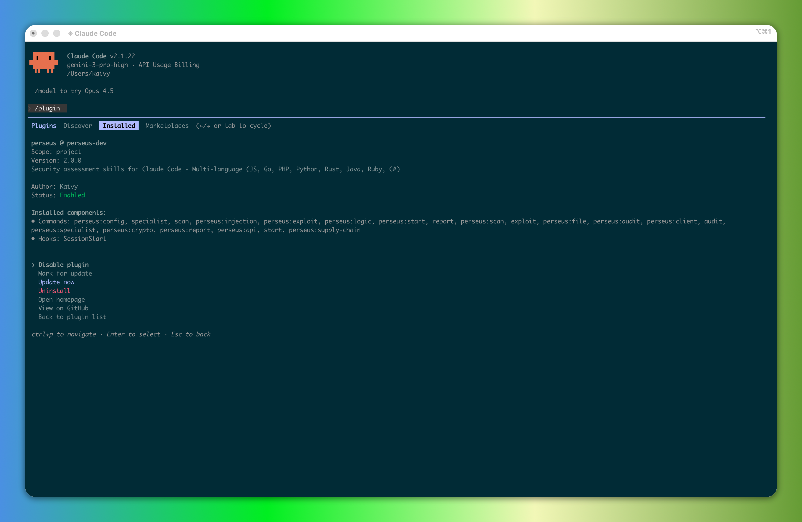

# Perseus Security Skills for Claude Code



Perseus is a comprehensive suite of interactive security assessment skills for Claude Code. It transforms Claude into an autonomous penetration testing partner for **your own codebase**, capable of performing everything from initial reconnaissance to deep-dive vulnerability research and executive reporting.

> **Defensive Security Testing:** Perseus analyzes your own code to find vulnerabilities before attackers do. This is equivalent to running a security linter or static analyzer.

## Features

### Multi-Language Support (8 Languages)
| Language | Frameworks |
|----------|------------|
| JavaScript/TypeScript | Express, Fastify, Next.js, Nest.js, Hono, Bun |
| Go | Gin, Echo, Fiber, Chi |
| PHP | Laravel, Symfony, Slim, Lumen |
| Python | FastAPI, Django, Flask, Starlette |
| Rust | Actix-web, Axum, Rocket, Warp |
| Java | Spring Boot, Quarkus, Micronaut |
| Ruby | Rails, Sinatra, Grape |
| C# | ASP.NET Core, Minimal APIs |

### Smart Auto-Detection
Perseus automatically detects your project's:
- **Language & Framework** (Next.js, Django, Spring, etc.)
- **Database** (PostgreSQL, MongoDB, Redis, etc.)
- **Infrastructure** (Docker, Kubernetes, AWS/GCP/Azure)
- **CI/CD** (GitHub Actions, GitLab CI, Jenkins)
- **AI/LLM** (OpenAI, Anthropic, LangChain)

### Extended Coverage
- **API Security**: REST, GraphQL, WebSocket, gRPC, OAuth, Cache poisoning
- **Injection**: SQL, NoSQL, Command, SSTI, LDAP, XPath, Log4j
- **Infrastructure**: Docker, CI/CD, Cloud (AWS/GCP/Azure), Kubernetes
- **AI Security**: Prompt injection, RAG security, tool use validation
- **Client-Side**: React, Next.js SSR, Vue, Angular, Server Actions

---

## Installation

### Claude Code
```
/plugin install https://github.com/kaivyy/perseus
```

That's it! Everything is automatic:
- Skills and commands auto-discovered
- Hooks auto-registered
- Context injected on session start

### Codex
```bash
git clone https://github.com/kaivyy/perseus.git ~/.codex/perseus
mkdir -p ~/.agents/skills
ln -sf ~/.codex/perseus/skills ~/.agents/skills/perseus
```

### OpenCode
```bash
git clone https://github.com/kaivyy/perseus.git ~/.config/opencode/perseus && \
  mkdir -p ~/.config/opencode/plugins ~/.config/opencode/skills && \
  ln -sf ~/.config/opencode/perseus/.opencode/plugins/perseus.js ~/.config/opencode/plugins/perseus.js && \
  ln -sf ~/.config/opencode/perseus/skills ~/.config/opencode/skills/perseus
```

### Uninstall
```
/plugin uninstall perseus
```

---

## Quick Start

```bash
# Full automated assessment (with smart auto-detect)
/start

# Or run key steps manually
/scan        # Phase 1: Reconnaissance
/report      # Phase 4: Executive Report

# Optional: run all specialists
/specialist
```

---

## Engagement Modes

Perseus uses explicit verification modes during assessment:

| Mode | Environment | Verification Style |
|------|-------------|--------------------|
| `PRODUCTION_SAFE` | Live production | Passive-first checks + minimal non-disruptive validation |
| `STAGING_ACTIVE` | Staging/pre-production | Active verification with strict throttling |
| `LAB_FULL` | Isolated lab | Broad dynamic verification |
| `LAB_RED_TEAM` | Dedicated security lab | Controlled adversarial chain simulation with kill-switches |

Default mode is `PRODUCTION_SAFE` when environment is unclear.

---

## Core Assessment Phases

Perseus follows a structured 4-phase methodology:

### Phase 1: Scan (Reconnaissance)
Maps architecture, entry points, dependencies, and attack surface.

| Command | Agents | Output |
|---------|--------|--------|
| `/scan` | 13 parallel agents | `deliverables/code_analysis_deliverable.md` |

**Coverage:**
- Architecture & Tech Stack (auto-detect 8 languages)
- Entry Points (API, GraphQL, WebSocket, gRPC)
- Dependencies & CVEs
- Hardcoded Secrets
- Security Patterns (Auth, Authz)
- Injection Sinks & XSS Sinks
- SSRF & Data Flows
- Crypto Usage
- Security Headers & Config

### Phase 2: Audit (Vulnerability Analysis)
Deep white-box analysis using Negative Analysis Loop (Source → Flow → Sink → Defense → Verdict).

Runs automatically after Scan during `/start`.

**Wave 1:** SQL Injection, Command Injection, XSS, Auth, Authz
**Wave 2:** SSRF, Template Injection, Deserialization, Path Traversal, XXE
**Wave 3:** JWT, Crypto, Race Conditions, Business Logic

### Phase 3: Exploit (Verification)
Verify findings with mode-aware safe Proof-of-Concept payloads.

Runs automatically after Audit during `/start`.

**Safe Payloads Only:**
- SQL: `SLEEP(5)`, `AND 1=1`
- Command: `sleep 5`, `whoami`
- XSS: `alert(1)`, `alert(document.domain)`
- SSTI: `{{7*7}}` → `49`

### Phase 4: Report (Executive Summary)
Synthesize all findings into professional security report.

| Command | Output |
|---------|--------|
| `/report` | `deliverables/SECURITY_REPORT.md` |

**Report Includes:**
- Executive Summary & Risk Overview
- Engagement mode and verification coverage
- Technologies Analyzed (language, framework, infrastructure)
- Verified Exploits with PoC
- Infrastructure Security (Docker, CI/CD, Cloud, K8s)
- AI/LLM Security Findings
- Supply Chain Summary
- Language-specific Remediation Guidance
- Strategic Recommendations

---

## Specialist Deep-Dive Skills

Perseus provides 8 enhanced specialist skills with multi-language support. These run automatically during `/start` when relevant signals are detected. Use `/specialist` to force-run all of them.

| Skill | Coverage |
|-------|----------|
| api | OWASP API Top 10, GraphQL, WebSocket, OAuth, Cache, gRPC |
| injection | NoSQL, LDAP, XPath, SSTI, Command, Log4j, Expression Language |
| crypto | JWT (8 languages), Hashing, Encryption, Key Management |
| supply-chain | CVEs (8 package managers), Typosquatting, Dependency Confusion |
| file | Path Traversal, Upload Bypass, XXE, Zip Slip (8 languages) |
| logic | Business Logic, Race Conditions, **AI/LLM Security**, Price Manipulation |
| client | React, Next.js SSR, Server Actions, Vue, Angular, Svelte |
| config | **Docker, CI/CD, Cloud (AWS/GCP/Azure), Kubernetes** |

---

## Command Reference

### Short Commands (Aliases)
| Command | Description |
|---------|-------------|
| `/start` | Full automated assessment with smart auto-detect |
| `/scan` | Phase 1: Reconnaissance |
| `/report` | Phase 4: Executive Report |

### Specialist Command
| Command | Description |
|---------|-------------|
| `/specialist` | Run all specialist skills |

### Full Commands
| Command | Description |
|---------|-------------|
| `/perseus:start` | Full automated assessment |
| `/perseus:scan` | Reconnaissance |
| `/perseus:report` | Executive Report |

### Full Specialist Command
| Command | Description |
|---------|-------------|
| `/perseus:specialist` | Run all specialist skills |

---

## Output Structure

After a full assessment, the `deliverables/` directory contains:

```
deliverables/
├── engagement_profile.md          # Mode, scope, limits, kill-switch thresholds
├── code_analysis_deliverable.md    # Scan results (multi-language)
├── sql_injection_analysis.md       # Audit reports
├── command_injection_analysis.md
├── xss_analysis.md
├── auth_analysis.md
├── authz_analysis.md
├── ssrf_analysis.md
├── template_injection_analysis.md
├── deserialization_analysis.md
├── path_traversal_analysis.md
├── xxe_analysis.md
├── jwt_analysis.md
├── crypto_analysis.md
├── race_condition_analysis.md
├── business_logic_analysis.md
├── api_security_analysis.md        # Specialist reports
├── injection_deep_analysis.md
├── crypto_security_analysis.md
├── supply_chain_analysis.md
├── file_security_analysis.md
├── client_side_analysis.md
├── config_security_analysis.md     # Includes Docker/CI/K8s
├── verification_scope.md           # Verification boundaries and approved test window
├── exploitation_report.md          # Verified exploits
└── SECURITY_REPORT.md              # Final executive report
```

---

## Project Structure

```
perseus/
├── commands/                    # Command definitions
│   ├── scan.md                  # Short aliases
│   ├── report.md
│   ├── start.md
│   ├── specialist.md
│   ├── perseus-scan.md          # Full commands
│   ├── perseus-report.md
│   ├── perseus-start.md
│   └── perseus-specialist.md
├── skills/
│   └── perseus/
│       ├── scan/SKILL.md        # Core skills
│       ├── audit/SKILL.md
│       ├── exploit/SKILL.md
│       ├── report/SKILL.md
│       ├── start/SKILL.md
│       ├── using-perseus/SKILL.md
│       └── specialists/         # Specialist skills
│           ├── api/SKILL.md
│           ├── injection/SKILL.md
│           ├── crypto/SKILL.md
│           ├── supply-chain/SKILL.md
│           ├── file-security/SKILL.md
│           ├── logic/SKILL.md
│           ├── client/SKILL.md
│           ├── config/SKILL.md
│           └── all/SKILL.md
├── scripts/
│   ├── post-install.sh          # Auto symlink + hook patch
│   └── uninstall.sh
├── hooks/
│   ├── hooks.json
│   └── session-start.sh
├── tests/
│   ├── README.md
│   ├── run-tests.sh
│   └── validate-structure.cjs
├── LICENSE
└── README.md
```

---

## Running Tests

```bash
./tests/run-tests.sh
```

Validates:
- Metadata files (plugin.json, manifest.json)
- Core skills (6 skills)
- Specialist skills (9 skills)
- Short commands (4 commands)
- Perseus commands (4 commands)

---

## Safety & Ethics

Perseus is designed for **defensive security testing only**:

- All analysis is performed on **your own codebase**
- Safe payloads only (no destructive operations)
- `PRODUCTION_SAFE` is the default mode
- Aggressive simulation is restricted to staging/lab modes
- `LAB_RED_TEAM` requires isolated environment and non-production data
- Kill-switch can stop active tests with `ABORTED-SAFETY`
- No data exfiltration
- Evidence-based reporting (no hallucinations)
- Equivalent to running security linters or SAST tools

---

## Troubleshooting

### Hook Blocking Issue

**Problem:** Perseus scan/start fails with error like:
```
Error: PreToolUse:Write hook error: ⚠️ Security Warning: dangerouslySetInnerHTML...
```

**Cause:** The `security-guidance` plugin blocks files containing security-related keywords, even in documentation.

**Solution 1: Automatic (Recommended)**

Restart your Claude Code session. Perseus auto-patches the security hook on session start:
```bash
/clear
# Then run Perseus again
/scan
```

**Solution 2: Manual Patch**

If auto-patch doesn't work, run manually:
```bash
~/.claude/plugins/perseus/scripts/post-install.sh
```

**Solution 3: Patch All Hook Locations**

The security hook may exist in multiple locations (cache + marketplaces). Patch all:
```bash
# Find all hook locations
find ~/.claude -name "security_reminder_hook.py"

# The script patches all locations automatically
bash ~/.claude/plugins/perseus/hooks/session-start.sh
```

**Solution 4: Disable Security Hook (Temporary)**

```bash
export ENABLE_SECURITY_REMINDER=0
```

### Deliverables Not Created

**Problem:** `deliverables/` folder is empty after scan.

**Cause:** Hook blocked file writing (see above).

**Solution:** Fix the hook issue, then run `/scan` again.

### Skills Not Found

**Problem:** `/scan` or `/start` says skill not found.

**Solution:** Run the post-install script:
```bash
~/.claude/plugins/perseus/scripts/post-install.sh
```

This creates all necessary symlinks automatically.

### Session Start Hook Not Running

**Problem:** Auto-patch doesn't happen on session start.

**Solution:** Verify hooks.json exists and is valid:
```bash
cat ~/.claude/plugins/perseus/hooks/hooks.json
```

Should contain `SessionStart` configuration.

---

## Changelog

### v2.2.2 (2026-02)
- Simplified slash commands to 3 main entries plus `/specialist`
- Renamed command files to Windows-safe filenames
- Updated docs and structure validation to match new command set

### v2.2.1 (2026-02)
- Added engagement modes: `PRODUCTION_SAFE`, `STAGING_ACTIVE`, `LAB_FULL`, `LAB_RED_TEAM`
- Added mode-aware verification and specialist safety gates
- Added kill-switch behavior and `ABORTED-SAFETY` outcomes
- Added new deliverables: `engagement_profile.md`, `verification_scope.md`
- Improved reporting with verification coverage and context-aware risk weighting

### v2.0.0 (2026-02)
- **Multi-Language Support**: Added support for 8 languages (JS, Go, PHP, Python, Rust, Java, Ruby, C#)
- **Smart Auto-Detect**: `/start` now auto-detects language, framework, and infrastructure
- **Infrastructure Security**: Added Docker, CI/CD, Cloud (AWS/GCP/Azure), Kubernetes analysis
- **AI/LLM Security**: Added prompt injection, RAG security, tool use validation
- **Enhanced Specialists**: All 8 specialists now support multiple languages
- **Improved Report**: Added infrastructure, AI, and supply chain sections

### v1.0.0 (2026-01)
- Initial release with core phases and specialists

---

## Documentation

| Platform | Guide |
|----------|-------|
| Claude Code | [docs/README.claude.md](docs/README.claude.md) |
| Codex | [docs/README.codex.md](docs/README.codex.md) |
| OpenCode | [docs/README.opencode.md](docs/README.opencode.md) |

---

## License

MIT
